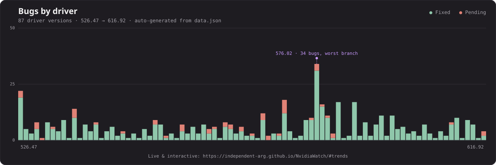

# NvidiaWatch
 
**Live:** [independent-arg.github.io/NvidiaWatch](https://independent-arg.github.io/NvidiaWatch/)
 
I built this simple tracker to log bugs found in NVIDIA drivers (Game Ready & Studio) and create a searchable database of known issues - whether they're fixed, pending, or simply forgotten. Yes, sometimes bugs just disappear in the next driver release with no explanation: was it actually fixed? Was it an external issue? Does it still exist? No one knows.

This database can help in several ways. For example, we can analyze which driver branches were hit hardest by bugs and which were the most stable. All data is sourced from official NVIDIA releases.

## Bug trends



---

## Features

- Search across games, driver versions, and known issues
- Filter by status (pending or fixed)
- Sort by driver version or number of bugs
- Multiple view modes (masonry/timeline) and theme toggle
- Quick overview: total drivers tracked, issues logged, and fix rate
- Interactive "bugs by driver" trends chart, with a static image fallback when JavaScript is off
- Fully readable with JavaScript disabled: every driver card and bug is in the HTML at load time

## How it's built

The site is built with [Eleventy](https://www.11ty.dev/) (an SSG - static site generator): driver cards and stats are pre-rendered to plain HTML at build time from `src/_data/drivers.json`, so the page is fully readable and searchable (Ctrl+F, SEO, screen readers) even with JavaScript disabled. `src/script.js` is a progressive-enhancement layer on top of that pre-rendered markup - it reads `data-*` attributes already in the DOM (no fetch, no re-render) to add search, status/sort filters, pagination, the interactive trends chart, and the theme/view-mode toggles. Controls that only work with JavaScript (search box, filter chips, pagination, etc.) are hidden until a `js` class is applied to `<html>`, so a no-JS visitor never sees dead buttons. Deployed to GitHub Pages via GitHub Actions, which runs the build and publishes the generated `_site/` output. Icons from Ionicons, fonts from Google Fonts.

```
src/
├── index.njk               # homepage template
├── style.css
├── script.js
├── assets/
│   └── bugs-chart-dark.svg # auto-generated, see scripts/generate_chart.py
├── _includes/
│   └── base.njk             # shared layout (head, nav, footer)
└── _data/
    ├── drivers.json         # driver and issue data
    ├── stats.js              # computed summary stats
    └── driversSorted.js      # computed sort order
```

### Local development

```
npm install
npm run build     # outputs the static site to _site/
npm run serve      # local dev server with live reload
```
 
## Contributing

Found a bug in a driver or know of an issue that's missing? Open an issue or submit a PR with the driver version, affected games/apps, and details.

## License

MIT - see [LICENSE](LICENSE). You're free to reuse or fork this.

## Credit

Built by [independent-arg](https://github.com/independent-arg) for the community. Data is sourced from official NVIDIA release notes.
